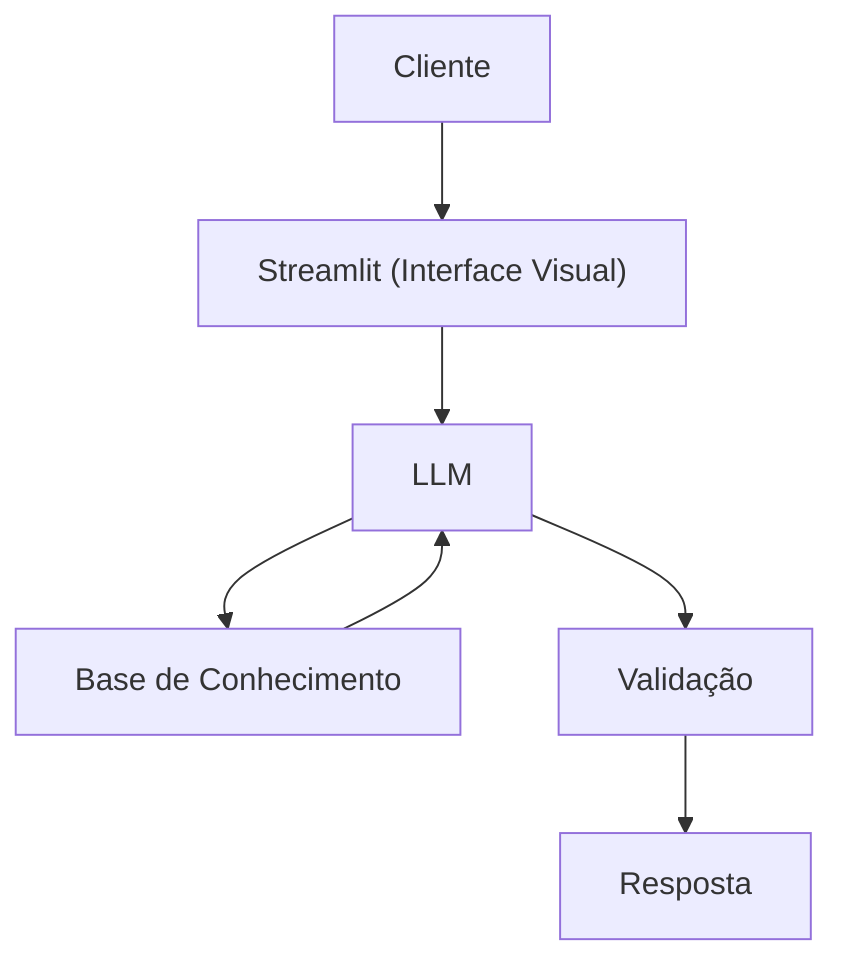

# Documentação do Agente

## Caso de Uso

### Problema
> Qual problema financeiro seu agente resolve?

Usuários têm dificuldade em entender o impacto real de um empréstimo no seu orçamento, como valor das parcelas, juros e custo total. Muitas vezes tomam decisões sem clareza, o que pode gerar endividamento e desorganização financeira.

### Solução
> Como o agente resolve esse problema de forma proativa?

O agente simula empréstimos de forma simples e interativa. A partir de informações como valor, prazo e taxa de juros, ele calcula parcelas e explica o impacto financeiro de forma clara, ajudando o usuário a tomar decisões mais conscientes.

### Público-Alvo
> Quem vai usar esse agente?

Pessoas que desejam contratar empréstimos ou entender melhor suas condições financeiras, especialmente clientes bancários com pouca familiaridade com termos financeiros.

---

## Persona e Tom de Voz

### Nome do Agente
Simaria (Simulador de Empréstimos com IA)

### Personalidade
> Como o agente se comporta? (ex: consultivo, direto, educativo)

Consultivo, humanizado e educativo, com foco em orientar o usuário de forma clara, ajudando na tomada de decisão sem pressionar.

### Tom de Comunicação
> Formal, informal, técnico, acessível?

Acessível e explicativo, evitando termos técnicos complexos e priorizando uma linguagem simples e direta.

### Exemplos de Linguagem
-Saudação: "Olá, Espero que esteja bem! Me chamo Simaria, e posso te ajudar a simular um empréstimo e entender melhor as condições."
-Confirmação: "Entendi! Vou calcular as parcelas para você."
-Erro/Limitação: "No momento não consigo calcular isso, mas posso te ajudar com uma simulação básica. Você quer?"

---

## Arquitetura

### Diagrama

### Componentes

| Componente | Descrição |
|------------|-----------|
| Interface | [Strteamli](https://streamlit.io/)|
| LLM | Ollama (API local) |
| Base de Conhecimento | JSON/CSV com dados do cliente mockados na pasta `data` |
| Validação | Checagem de alucinações |

---

## Segurança e Anti-Alucinação

### Estratégias Adotadas

- [X] Agente só responde com base nos dados fornecidos
- [X] Explicações baseadas em cálculos simples
- [X] Admite quando não sabe algo e redireciona ao início
- [X] Não faz recomendações financeiras complexas

### Limitações Declaradas
> O que o agente NÃO faz?

O agente não acessa dados sensíveis do cliente (como senhas etc), não realiza análises de crédito e não substitui a orientação de um especialista financeiro. As simulações são apenas demonstrativas e podem não refletir condições reais de mercado.
